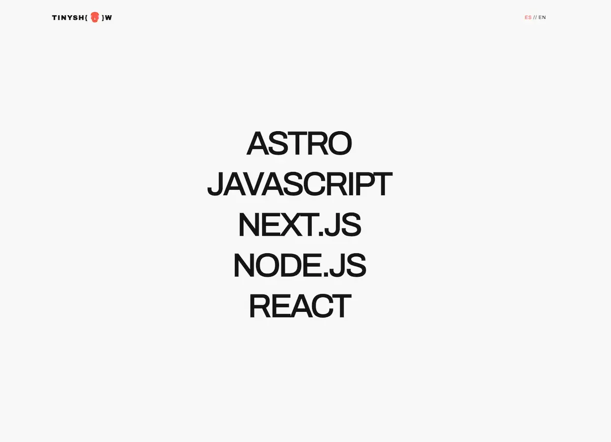

# TINYSHOW

Escaparate de proyectos automatizado. Brutalista. Rápido.

---



---

## Qué es

TinyShow es un motor de visualización de proyectos que se alimenta directamente de tus repositorios de GitHub.

Escanea los README de tus repos, extrae la información relevante usando IA (DeepSeek), y genera fichas de proyecto con traducciones automáticas a inglés y español.

Sin entrada manual de datos. Actualiza un README, el proyecto se actualiza solo.

---

## Cómo funciona

1. Se ejecuta el seed (para poblar la base de datos) o se recibe un webhook de GitHub
2. Se obtiene el contenido del README del repositorio
3. DeepSeek extrae: título, descripción, stack tecnológico, enlaces
4. Se genera contenido localizado (EN/ES)
5. Se almacena en PostgreSQL via Prisma
6. La interfaz renderiza los proyectos filtrados por tecnología

---

## Stack tecnológico

| Capa | Tecnología |
|------|------------|
| Framework | Nuxt 4 |
| UI | Vue 3 + Composition API |
| Estilos | Tailwind CSS 4 |
| Animaciones | GSAP |
| Base de datos | Neon (PostgreSQL) |
| ORM | Prisma |
| IA | DeepSeek API |
| Integración | GitHub API + Webhooks |
| Validación | Zod |
| i18n | @nuxtjs/i18n |

---

## Instalación

```bash
# Clonar repositorio
git clone https://github.com/tu-usuario/tinyshow.git
cd tinyshow

# Instalar dependencias
pnpm install

# Configurar variables de entorno
cp .env.template .env

# Ejecutar migraciones de Prisma
pnpm prisma migrate deploy

# Generar cliente de Prisma
pnpm prisma generate

# Poblar base de datos
pnpm seed

# Iniciar servidor de desarrollo
pnpm dev
```

---

## Variables de entorno

```
NEON_DATABASE_URL           # URL de conexión a Neon PostgreSQL
NUXT_DEEPSEEK_API_KEY       # Clave API de DeepSeek
GITHUB_SEED_TOKEN           # Token de acceso personal de GitHub
GITHUB_USERNAME             # Nombre de usuario de GitHub
NUXT_GITHUB_WEBHOOK_SECRET  # Secreto para validar webhooks de GitHub
NUXT_STRICT_MODE            # true para modo estricto (no permite proyectos sin imagen ni demo url)
```

---

## Scripts disponibles

| Comando | Descripción |
|---------|-------------|
| `pnpm dev` | Servidor de desarrollo |
| `pnpm build` | Compilación para producción |
| `pnpm preview` | Previsualización del build |
| `pnpm seed` | Poblar base de datos con todos los repos |
| `pnpm seed-single` | Poblar con un repositorio específico |
| `pnpm test-webhook` | Simular webhook de GitHub |

---

## Estructura del proyecto

```
tinyshow/
├── app/                 # Código fuente de Nuxt
│   ├── components/      # Componentes Vue
│   ├── composables/     # Composables reutilizables
│   ├── layouts/         # Layouts de la app
│   ├── pages/           # Páginas/rutas
│   ├── plugins/         # Plugins de Nuxt
│   └── assets/          # CSS global
├── server/              # Backend
│   ├── api/             # Endpoints de API y webhooks
│   └── utils/           # Utilidades del servidor
├── prisma/              # Esquema y migraciones
├── seed/                # Scripts de seeding
├── shared/              # Tipos y esquemas compartidos
├── i18n/                # Archivos de traducción
└── public/              # Assets estáticos
```

---

## Modelo de datos

Cada proyecto contiene:

- **id**: Identificador único (nombre del repo)
- **title**: Título del proyecto
- **tagline**: Frase corta (EN/ES)
- **description**: Descripción detallada (EN/ES)
- **tech_stack**: Array de tecnologías
- **primary_tech**: Tecnología principal para filtrado
- **repo_url**: Enlace al repositorio
- **demo_url**: Enlace a demo (opcional)
- **img_url**: Imagen del proyecto (opcional)
- **origin**: Metadatos de origen si es de un curso

---

## Webhooks

TinyShow puede recibir webhooks de GitHub para actualizar proyectos automáticamente. Cuando se hace push a un README:

1. GitHub envía evento push al endpoint `/api/webhooks/github`
2. Se valida la firma del webhook
3. Se detecta si el README fue modificado
4. Se re-procesa el repositorio afectado

---

## Licencia

MIT
